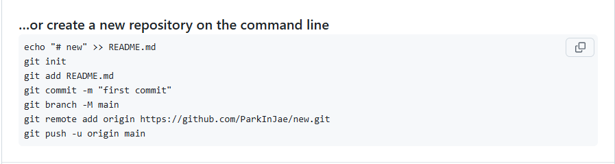

# gitHub 와 VSCode 연결
  


 1. git init (초창기) 
 2. git add . 
 3. git commit -m "first commit"
 4. git branch -M main // branch를 main으로 생성 
 if git branch -m master로 작성했다면 branch명이 master로 생성
 5. git remote add origin https://github.com/ParkInJae/react_chapter_04.git
 (git remote add origin 나의 repository 주소 )

 6.
   6-1 git push origin main // branch를 main으로 생성했을 때 

   6-2  git push origin master // branch를 master로 생성했을 때 
 
 # 에러 발생 
 1.  -- warning: in the working copy of 'README.md', LF will be replaced by CRLF 
the next time Git touches it 

->  Git이 파일의 줄바꿈 방식(LF와 CRLF)을 자동으로 변환하려고 할 때 발생하는 일반적인 알림입니다.

보통 Windows에서는 기본적으로 CRLF를 사용하고, Unix/Linux나 macOS에서는 LF를 사용하기 때문에 이런 차이가 발생함. 

# 해결방법 
<h2>Git 설정 변경하기 </h2>

1. Windows 환경
```
git config --global core.autocrlf true
```

2. macOS/Linux 환경 
```
git config --global core.autocrlf input
```

# 에러 발생 
1.  -- 에러 내용 
```

 ! [rejected]        master -> master (non-fast-forward)
error: failed to push some refs to 'https://github.com/ParkInJae/react_chapter_04.git'
hint: Updates were rejected because the tip of your current branch is behind
hint: its remote counterpart. If you want to integrate the remote changes,
hint: use 'git pull' before pushing again.
hint: See the 'Note about fast-forwards' in 'git push --help' for details.

```

->  이 오류 메시지는 로컬(master) 브랜치가 원격(master) 브랜치보다 뒤처져 있어서 발생하는 일반적인 Git 충돌 유형입니다.<br/>
 즉, 원격 저장소에 더 최신 커밋이 있는데, 로컬에서는 그 커밋을 가져오지 않고 푸시를 시도하니 “non-fast-forward” 오류가 발생함. <br/>

# 해결방법 

1. 오류가 발생하는 원인 <br/>
누군가(혹은 본인이 다른 환경에서) 원격 저장소에 먼저 커밋을 올렸고,
로컬 저장소가 그 커밋들을 받아오지 않은 상태에서 push를 하려고 할 때
Git이 “로컬이 원격보다 뒤처져 있으니, 원격 저장소에 있는 변경 사항부터 먼저 합치라”고 경고하는 것입니다. <br/>

2. 해결 방법<br/>
(1) 원격 변경 사항을 먼저 가져와서 병합(merge)하거나 리베이스(rebase)
원격 저장소 변경사항 받아오기 <br/>

```
git pull origin master
```

-> git pull을 통해 원격 저장소(master 브랜치)의 변경 내역을 로컬로 가져옵니다.
만약 자동 병합이 잘 되면 그대로 진행하면 됩니다.<br/>
충돌(conflict)이 발생하면, 충돌 난 파일을 수동으로 수정하고 다시 커밋합니다.<br/>

```
git push origin master

```

-> pull로 최신 내용을 병합했으니 이제 push가 정상적으로 될 것입니다. <br/>

<br/>선택사항
선택사항 rebase 방식으로 깔끔하게 이력 정리 <br/>
git pull --rebase origin master 명령어를 사용하면 머지 커밋 없이 로컬 변경 사항을 원격 브랜치 위에 얹는(rebase) 방식을 사용합니다. <br/>
충돌이 나면 수동으로 충돌을 해결한 뒤 git add . → git rebase --continue 순서로 진행합니다. <br/>
이후에 git push origin master로 마무리합니다. <br/>
주의: rebase 방식을 사용하면 Git 히스토리가 깔끔해지지만, 이미 공개 저장소에서 공유된 브랜치에 rebase를 남발하면 다른 협업자들의 이력이 꼬일 수 있으므로, 팀 내에서 허용하는지 확인해보세요. <br/>

(2) 강제 푸시(Force Push) 
정말 “원격 저장소의 변경 사항을 무시”하고 로컬 이력만으로 덮어쓰고 싶다면:

```
git push origin master --force

```

하지만 이렇게 하면 원격 저장소에 있던 커밋들이 사라질 수 있고, 협업 중이라면 다른 사람들의 작업 이력이 날아가거나 이력이 꼬여버리는 심각한 문제가 생길 수 있습니다. <br/>
따라서, 개인 저장소에서 내 로컬 이력만 남기고 싶을 때 또는 원격 변경 내역이 필요 없을 때만 제한적으로 사용하세요. <br/>
<br/><br/>

3. 정리
<br/>
non-fast-forward 오류는 원격에 더 새로운 커밋이 있어, 로컬 브랜치가 뒤처졌을 때 발생합니다. <br/>
가장 일반적인 해결책은 git pull origin master(또는 git pull --rebase origin master)로 원격 저장소의 변경을 받아와서 충돌을 해결한 후, 다시 git push origin master를 수행하는 것입니다.<br/>
“원격 커밋이 필요 없다”면 강제 푸시(git push --force)를 할 수도 있지만, 협업 환경에서 매우 위험할 수 있으므로 주의가 필요합니다. <br/>